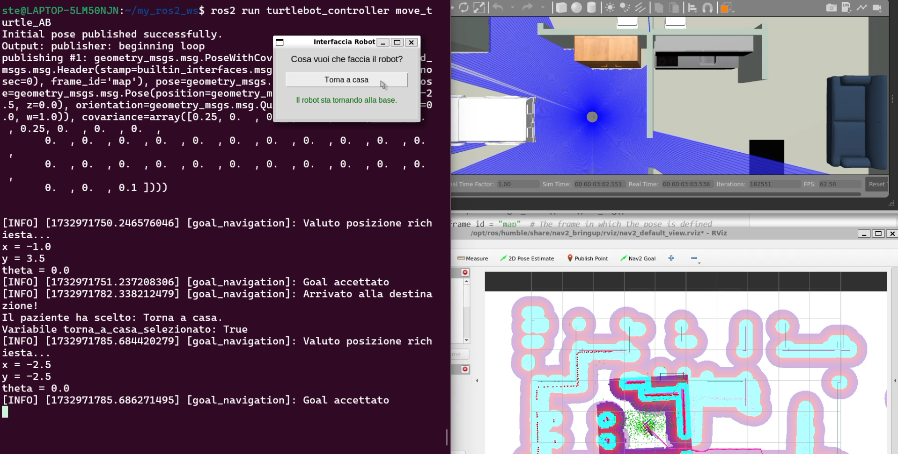

# TurtleBot Navigation System

This project implements an autonomous navigation system using ROS2 and Nav2. The TurtleBot robot is configured to move in a simulated environment (and potentially real) following specific goals and saving navigation data for analysis.
## Simulation
[](robot_simulation.mp4)

## Download Simulation Video
[Download and watch the robot simulation in action](robot_simulation.mp4)

---
## Table of Contents
- [TurtleBot Navigation System](#turtlebot-navigation-system)
  - [Simulation](#simulation)
  - [Download Simulation Video](#download-simulation-video)
  - [Table of Contents](#table-of-contents)
  - [Commands to Execute Visualization](#commands-to-execute-visualization)
  - [](#)
  - [Introduction](#introduction)
  - [Prerequisites](#prerequisites)
  - [ROS2 Configuration](#ros2-configuration)
    - [Ubuntu Installation](#ubuntu-installation)
    - [ROS2 Installation](#ros2-installation)
  - [Installation of necessary packages Nav2](#installation-of-necessary-packages-nav2)
  - [Project Import](#project-import)
  - [Launching the simulation](#launching-the-simulation)
  - [Node Structure](#node-structure)
    - [Main node: `move_turtle_AB`](#main-node-move_turtle_ab)
    - [Support nodes](#support-nodes)
  - [Launching the nodes](#launching-the-nodes)
  - [Data Visualization](#data-visualization)
  - [Map Configuration](#map-configuration)
  - [Simulation Phases](#simulation-phases)
  - [Future Developments](#future-developments)
  - [Authors and Contacts](#authors-and-contacts)

---
## Commands to Execute Visualization

---
## Introduction
The project combines robotics and mobility support to assist patients in a rehabilitation context. It includes the configuration of ROS2, Nav2, RViz, and Gazebo for TurtleBot simulation.

---

## Prerequisites
- Ubuntu 22.04 with ROS2 Humble installed.
- `WSL2` (if on Windows).
- Necessary Python packages installed (see [requirements.txt](#)).

---

## ROS2 Configuration
### Ubuntu Installation
1. Enable WSL:
   ```bash
   wsl --install
   ```
2. Install Ubuntu Jellyfish:
   ```bash
   wsl --install -d Ubuntu-22.04
   ```
3. Configure the environment:
   ```bash
   wsl -d Ubuntu-22.04
   ```

### ROS2 Installation
1. Configure UTF-8:
   ```bash
   locale  # check for UTF-8
   
   sudo apt update && sudo apt install locales
   sudo locale-gen en_US en_US.UTF-8
   sudo update-locale LC_ALL=en_US.UTF-8 LANG=en_US.UTF-8
   export LANG=en_US.UTF-8
   
   locale  # verify settings
   ```
2. Make sure Ubuntu Universal Repository is enabled
   ```bash
   sudo apt install software-properties-common
   sudo add-apt-repository universe
   ```
3. Add ROS2 GPG key
   ```bash
   sudo apt update && sudo apt install curl -y
   sudo curl -sSL https://raw.githubusercontent.com/ros/rosdistro/master/ros.key -o /usr/share/keyrings/ros-archive-keyring.gpg
   ```
4. Add the repository to the source list:
   ```bash
   echo "deb [arch=$(dpkg --print-architecture) signed-by=/usr/share/keyrings/ros-archive-keyring.gpg] http://packages.ros.org/ros2/ubuntu $(. /etc/os-release && echo $UBUNTU_CODENAME) main" | sudo tee /etc/apt/sources.list.d/ros2.list > /dev/null
   ```
5. Before starting the installation, check all packages:
   ```bash
   sudo apt update
   sudo apt upgrade
   ```
6. Install ROS2 and additional packages:
   ```bash
   sudo apt install ros-humble-desktop
   sudo apt install ros-dev-tools
   ```
7. Run this command to configure the ROS 2 environment in your current shell
   ```bash
   source /opt/ros/humble/setup.bash
   ```
---

## Installation of required packages Nav2
1. Install Nav2 packages:
   ```bash
   sudo apt install ros-humble-navigation2 ros-humble-nav2-bringup
   ```
2. Install TurtleBot packages for Gazebo:
   ```bash
   sudo apt install ros-humble-turtlebot3-gazebo
   ```
To allow proper startup, launch the base project for safety
```bash
   source /opt/ros/humble/setup.bash
   export TURTLEBOT3_MODEL=waffle
   export GAZEBO_MODEL_PATH=$GAZEBO_MODEL_PATH:/opt/ros/humble/share/turtlebot3_gazebo/models
   source /usr/share/gazebo/setup.bash
   ros2 launch nav2_bringup tb3_simulation_launch.py
   ```
If it doesn't work, restart the platform you are working on.

---
## Project Import
1. Clone the GitHub repository:
   ```bash
   git clone https://github.com/tetano02/turtlebot_workspace.git
   ```
2. Export files to Nav2 directories:
   ```bash
   sudo mkdir /opt/ros/humble/share/turtlebot3_gazebo/models/planimetria_santanna
   sudo cp -r ~/turtlebot_workspace/src/turtlebot_controller/models/planimetria_santanna/* /opt/ros/humble/share/turtlebot3_gazebo/models/planimetria_santanna
   ```
3. Replace the Gazebo texture file:
   ```bash
   sudo rm /usr/share/gazebo-11/media/materials/scripts/gazebo.material
   sudo cp ~/turtlebot_workspace/src/turtlebot_controller/gazebo.material /usr/share/gazebo-11/media/materials/scripts/
   ```
4. For the correct functioning of the project, also execute the following commands
   ```bash
   pip install pandas
   pip upgrade matplotlib
   ```
   If the last command doesn't work, use the following command.
   ```bash
   pip install --upgrade matplotlib
   ```
---

## Launching the simulation
1. Prepare the environment:
   ```bash
   source /opt/ros/humble/setup.bash
   export TURTLEBOT3_MODEL=waffle
   export GAZEBO_MODEL_PATH=$GAZEBO_MODEL_PATH:/opt/ros/humble/share/turtlebot3_gazebo/models
   ```
   If it doesn't work, also add this command
   ```bash
   source /usr/share/gazebo/setup.bash
   ```
3. Build the workspace:
   ```bash
   cd turtlebot_workspace
   colcon build
   source install/setup.bash
   ```
4. Launch the simulation:
   ```bash
   ros2 launch turtlebot_controller tb3_santanna_launch.py
   ```
---

## Node Structure
### Main node: `move_turtle_AB`
- Manages autonomous navigation from point A to point B.
- Estimates the initial position and sends goals via the Action Client.

### Support nodes
- `turtle_distance_publisher`: Calculates and publishes the distance traveled.
- `turtle_csv_handler`: Saves navigation data in CSV format.

---
## Launching the nodes
To launch the nodes follow these commands
1. Open a new tab from terminal.
2. Build the workspace:
   ```bash
   cd turtlebot_workspace
   colcon build
   source install/setup.bash
   ```
3. Launch the node that publishes the distance:
   Node that publishes the distance:
   ```bash
   ros2 run turtlebot_controller turtle_distance_publisher
   ```
4. Execute steps 1 and 2 again
5. Launch the node that creates csv files with robot data:
   Node that creates csv:
   ```bash
   ros2 run turtlebot_controller turtle_csv_handler
   ```
6. Execute steps 1 and 2 again
7. Node that allows the robot to move:
   ```bash
   ros2 run turtlebot_controller move_turtle_AB
   ```
---
## Data Visualization
After launching the simulation and the nodes, to visualize the simulation data it is necessary to execute the following commands.
```bash
   cd ~/turtlebot_workspace/src/turtlebot_controller/script_python
   python3 elaborate_data.py
```
---
## Map Configuration
1. The floor plan was converted to `.pgm` format and parameters set in the `.yaml` file.
2. Gazebo was configured with reference files and by adding downloaded models.
---
## Simulation Phases
1. **Movement to destination**: The robot moves towards the bed, saving data.
2. **Return to base**: By pressing a simulated button, the robot returns to the initial position.
---
## Future Developments
- Implementation on real hardware with:
  - Walker configuration.
  - Testing in real hospital environments.
- Improvements to the user interface and navigation system reliability.
---

## Authors and Contacts 
For information or bug reports, contact the development team: 
- [Stefano Agnelli](https://github.com/tetano02)
- [Michele Giovanelli]()
- [Wen Wen Sun](https://github.com/sunwenwen2002)
